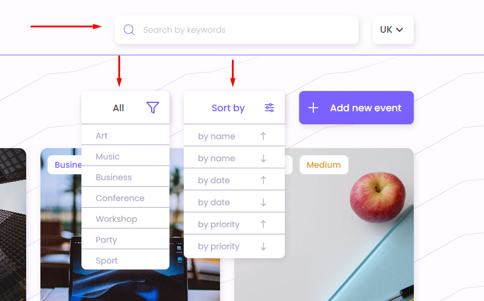
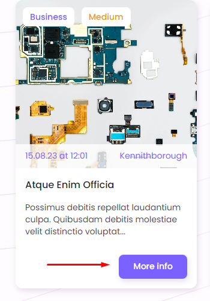
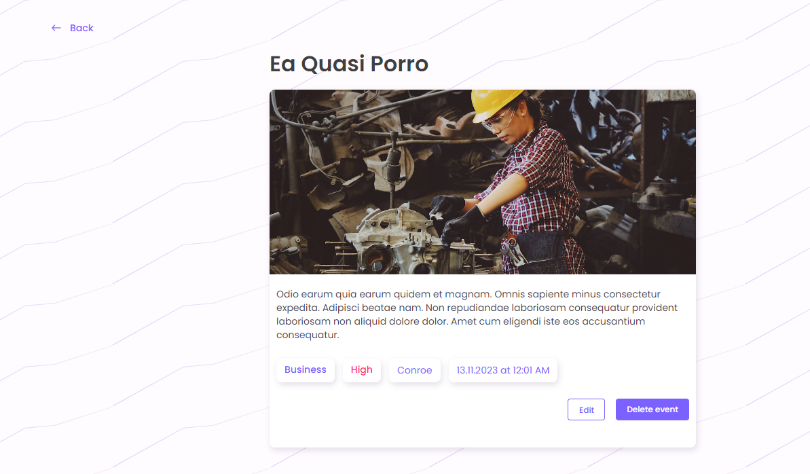
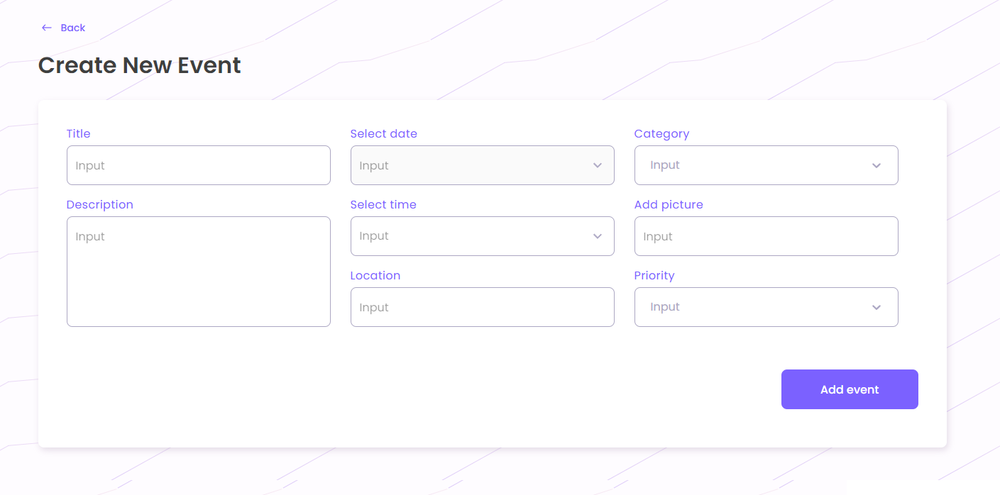

# Event planner

Проект створено за допомогою React. Також пристуній адаптив для мобільних
пристроїв та планшетів.

## 0. Common

Загалом застосунок містить 4 сторінк:

1.Сторінка із списком подій. 2. Сторінка однієї події. 3-4. Сторінки створення
та редагування події.

## 1. Home page

На цій сторінці відображаються усі доступні події. Кожна подія представлена
зображенням, заголовком, описом, локацією, датою та часом і категорією із рівнем
пріоритету.

Додано можливість сортування подій за заголовком та описом через поле пошуку.
Пошук відбувається посимвольно. Виконана нормалізація заголовків і поля
фільтрації, щоб пошук був нечутливий до регістру.

Також події можна фільтрувати відповідно до обраної категорії, а також сортувати
за назвою, датою або пріоритетом. Поруч кнопка додавання нової події, яка
переадресовує на сторінку створення події.

При відображенні однієї картки при ховері з`являється кнопка переходу на
сторінку однієї події, якщо дата цієї події в майбутньому. Якщо дата вже минула,
перейти на сторінку неможливо і кнопка відключена із текстом "Expired".

## 2. Event page

На сторінці події відображено інформацію про неї та дві кнопки. Одна видаляє
подію, інша переходить на сторінку редагування події.Також є кнопка повернення
назад на сторінку всіх подій

## 3. Create event and edit event page

На цих сторінках присутня форма, яка необхідна для створення та редагування
події.

Поля форми проходять валідацію під час заповнення форми. Після відправки форми
відбувається повернення на головну сторінку під час створення нової події або на
сторінку події у випадку її редагування.
